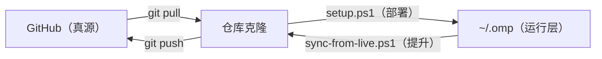

# omp-config

个人 Oh My Pi (omp) 配置仓库 — 跨机器同步配置、技能和工具。

## 三层同步模型

| 层级 | 路径 | 角色 |
|------|------|------|
| 运行层 | `~/.omp`（各机器本地） | omp 实际读取的配置；机器本地项（`shellPath`、`setupVersion`）只存在于这一层 |
| 仓库层 | 本仓库克隆 | 同步中转，模型定义（`models.yml`）与技能以此为源 |
| 真源层 | GitHub `origin/master` | 跨机器共同真源，所有机器从这里 pull |

配置同步全流程可视化：[docs/omp-config-sync.html](docs/omp-config-sync.html)（archify 生成，源文件 `docs/omp-config-sync.workflow.json`）



- **拉方向**（部署）：`git pull` → `setup.ps1`。覆盖式部署，密钥按 provider 保留本地已填值。
- **推方向**（提升）：`sync-from-live.ps1`。把运行层的配置改动提升回仓库并 push，`shellPath`/`setupVersion` 自动剥离，真实 apiKey 永不入仓（详见文末「反向同步」）。
- **分工**：`models.yml` 模型定义与计价、`skills/`、`lsp.json` 以仓库为源（推方向不回写）；`config.yml`、`settings.json` 等其余配置双向流动。

## 目录结构

```
omp-config/
├── agent/                    # → ~/.omp/agent/
│   ├── config.yml            # 全局配置（modelRoles, memory/mnemopi, TUI；shellPath 由 setup 探测）
│   ├── lsp.json              # LSP 服务器（默认 PATH 裸名，setup 探测覆盖）
│   ├── models.yml            # 模型提供商 + 人民币计价；apiKey 仓库留占位符，本地手动填（setup 不再交互）
│   └── settings.json         # 持久化设置
├── scripts/
│   └── bench-speed.ts        # 模型输出速度测试（仓库内 `bun` 运行，读 ~/.omp/agent/models.yml）
├── skills/                   # → ~/.omp/agent/skills/
├── setup.ps1                 # 一键部署脚本（仓库 → ~/.omp，Windows / PowerShell，纯配置无补丁）
├── sync-from-live.ps1        # 反向同步脚本（~/.omp → 仓库，密钥不入仓）
└── README.md
```

## 在新机器上安装

> **PowerShell**：`setup.ps1` 同时支持 Windows PowerShell 5.1 与 PowerShell 7+（脚本已带 UTF-8 BOM，中文注释/输出在两种环境下均解析正常；终端若显示中文乱码仅影响显示，不影响执行）。

- `setup.ps1` 会自动安装/升级 bun 全局包到推荐的 **OMP 18.1.20**（版本不同即重装）。支持自定义 `BUN_INSTALL`（`setup.ps1` / `doctor.ps1` 同一约定）。
- 已安装 `bun`
- 已安装语言服务器（gopls、pylsp 等）

### 步骤（一键部署）

```powershell
# 1. 克隆仓库
cd ~
git clone git@github.com:mr-money/omp-config.git

# 2. 一键部署（复制配置 + 探测路径 + 环境变量注入 key）
cd omp-config
.\setup.ps1
```

脚本流程（自动执行，无需手动抄步骤）：
1. 校验 bun / omp 已安装
2. 升级 omp 到推荐版本（`$RecommendedOmpVersion`，非匹配即重装）、复制 `agent/` → `~/.omp/agent/`、`skills/` → `~/.omp/agent/skills/`
3. 探测本机 pwsh / gopls / python 路径，写回对应配置
4. 注入 API Key：**不再交互输入**——仅从环境变量（`OMP_API_KEY`/`ZHIPU_API_KEY`）读取，设了就写入对应 provider；未设置则保留 `<...>` 占位符。重部署时**按 provider 保留本地已填的真实 key**（通用扫描全部 provider，非硬编码），结尾列出仍为占位符的 provider 与文件路径，提示手动编辑
5. 完成（本分支不部署任何 bundle 补丁，omp 保持原样）

只读健康检查：`.\doctor.ps1`。它检查 Bun、OMP/bundle 版本、三个配置文件存在性及 gopls/python 是否可用，不会自动修复。注意它只查部署健康，不查 live 与仓库之间的内容漂移——漂移用 `.\sync-from-live.ps1` 的预检查看（无差异时会明确输出"无需同步"）。

### 配置项一览

| 文件 | 字段 | 部署方式 | 说明 |
|------|------|----------|------|
| `~/.omp/agent/models.yml` | `apiKey` | 环境变量注入 / 本地手动编辑 | 各 provider 的 key：火山 `OMP_API_KEY`、智谱 `ZHIPU_API_KEY`。setup **不再交互**——设了环境变量就自动写入，没设则保留 `<...>` 占位符；重部署按 provider 保留本地已填真实 key，结尾列出未填项 |
| `~/.omp/agent/lsp.json` | `servers.*.command` | setup 探测覆盖 | 默认 PATH 裸名（`gopls` / `python -m pylsp`）；探测到绝对路径则写回 |
| `~/.omp/agent/config.yml` | `shellPath` | setup 探测写入 | 检测到 pwsh 则自动写入；未检测到则省略（omp 回退到 cmd.exe） |
| `~/.omp/agent/config.yml` | `statusLine` | 直接复制 | 自定义状态栏：custom 段列表（无 cost 段）、git 只显分支名、path 缩写、模型名带思考档位 |
| `~/.omp/agent/settings.json` | — | 直接复制 | 不再单独设 shellPath，统一走 config.yml |

### 验证

```powershell
# 启动 omp，状态栏显示：品牌 · 模型+思考档 · plan模式 · 路径 · git分支 · 上下文% ｜ 会话名（无 cost 段）
omp
```

### 状态栏 (`config.yml` → `statusLine`)

```yaml
statusLine:
  preset: custom
  leftSegments: [pi, vim, model, mode, collab, path, git, pr, context_pct]
  rightSegments: [session_name]
  segmentOptions:
    git:
      showBranch: true         # 只显示分支名
      showStaged: false        # 隐藏 +N（已暂存）
      showUnstaged: false      # 隐藏 *N（未暂存）
      showUntracked: false     # 隐藏 ?N（未跟踪）
    path:
      abbreviate: true         # 长路径缩写
      maxLength: 40
      stripWorkPrefix: true
    model:
      showThinkingLevel: true  # 模型名旁显示思考档位
```

段列表不含 `cost`（不显示任何费用信息），git 段只显示分支名。

### 模型角色 (`config.yml` → `modelRoles`)

| 角色 | 模型 | 思考档位 | 用途 |
|------|------|----------|------|
| `default` | glm-5-3-flash | — | 默认主模型，日常编码 |
| `plan` | GLM-5.3 | `high` | 任务规划阶段 |
| `slow` | GLM-5.3 | `max` | 深度推理 / 复杂问题 |
| `smol` | deepseek/deepseek-flash | `auto` | 轻量快速任务（官方 DeepSeek API，DeepSeek-V4.1-Flash，按量计费） |
| `advisor` | doubao-seed-evolving | `medium` | 顾问模式 |
| `designer` | doubao-seed-evolving | `medium` | UI/UX 设计任务 |
| `task` | glm-5-3-flash | `auto` | 任务子代理（委派多步任务） |
| `commit` | doubao-seed-2.0-mini | `off` | 生成 commit message |
| `vision` | doubao-seed-evolving | `auto` | 视觉/截图理解（方舟多模态） |
| `Zhipu` | zhipu/glm-5.3-flash | `high` | 智谱 GLM（自有余额付费，备用） |
| `DeepSeek` | deepseek/deepseek-flash | `auto` | 官方 DeepSeek API（omp 内置 provider，配 Key 后启用；备用，不在 `cycleOrder` 中。旧模型名 `deepseek-v4-flash` 等仍可调用，由 V4.1-Flash 服务并按 Flash 计价） |
| `agent-plan` | glm-5-3-flash | `auto` | 火山方舟 Agent Plan 通道（订阅制，1M 上下文，多模态；agent-plan 节点与 coding plan 各有一条 GLM 5.3 Flash，可在 `/models` 里区分选择） |

**思考档位循环 (`cycleOrder`)**: `smol` → `default` → `slow` → `agent-plan`，逐级升档。

### 长期记忆 (`config.yml` → `memory` / `mnemopi`)

```yaml
memory:
  backend: mnemopi
mnemopi:
  scoping: per-project-tagged   # 写入项目库；召回时合并共享全局库
  embeddingVariant: multilingual # intfloat/multilingual-e5-large（本地 ONNX，中文语义召回）
  recallLimit: 10                # 每次召回最多注入的记忆条数（默认 8）
```

设计依据（源码验证，pi-mnemopi 18.x）：

- **`per-project-tagged` 优于 `per-project`**：写入项目隔离，召回还能带上全局记忆——跨项目通用经验（如方舟网关踩坑）仍可浮现。
- **不要开 `noEmbeddings: true`**：FTS5 默认 `unicode61` tokenizer 对中文按整句切分（无分词），关掉向量召回会让中文查询只能逐字命中；`multilingual` e5 本地推理无网络依赖、无费用，是中文召回主力。
- **`llmMode: smol`**：事实抽取/整理走 `tiny`→`smol` 角色（doubao-seed-2.0-mini），免费额度内。
- **consolidation 需手动触发**：正常退出只做轻量 drain，working → episodic 晋级与图谱构建仅在 `/memory enqueue` 时发生（且只整理 >12h 的行）；重要会话结束前跑一次。
- **进阶开关保持关闭**：`polyphonicRecall` 的 graph voice 依赖 consolidation 产生的 `gists`/`graph_edges`（未触发时恒为空）；`proactiveLinking` 的实体抽取为英文偏置正则，中文收益微弱。

### 模型提供商 (`models.yml`)

内置火山引擎大模型 API（方舟，coding plan 订阅制）：
- **glm-5-3-flash** — 默认模型（1M 上下文）
- **glm-5.3** — 规划 / 慢速深度推理（1M 上下文）
- **deepseek-v4-1-flash-260910** — 方舟 DeepSeek V4.1 Flash（1M 上下文；升级自 `deepseek-v4-flash-ga-260731`，当前方舟 coding plan 尚未接入该模型，配置已切换、请求待开通后生效；`smol` 角色已改走官方 `deepseek/deepseek-flash`，此模型保留作方舟通道备选）
- **doubao-seed-2.0-mini** — 轻量 / commit / mnemopi 记忆抽取（`tiny`/`commit` 角色）
- **doubao-seed-evolving** — 顾问 / 设计 / 视觉（`advisor`、`designer`、`vision` 角色）（1M 上下文，多模态）

火山方舟 Agent Plan（`agent-plan` provider，订阅制，OpenAI 兼容）：
- **deepseek-v4.1-flash** — Agent Plan 通道 DeepSeek V4.1 Flash（1M 上下文，多模态文本+图像，393K 输出，`reasoning`；实测 TTFT ~1.4-1.9s、~155-180 tok/s，小输入正常，大输入警惕 TTFT 挂起）
- **glm-5-3-flash** — Agent Plan 通道 GLM 5.3 Flash（多模态文本+图像，1M 上下文；实测 TTFT ~1.2s、~71 tok/s，与 coding plan 同名模型互为备用）
- 与 coding plan 共用方舟 API Key，`baseUrl: https://ark.cn-beijing.volces.com/api/plan/v3`；仓库中占位脱敏，部署后本地填入
- ⚠️ 实测该端点对 deepseek 存在**服务端间歇性 TTFT 挂起**（约 50% 概率 >60s 零字节，输入 ≥~5K tokens 时出现，小输入秒回；doubao 同端点正常）。配置无法修复——omp 卡 "working" 时 esc 重试即可；持续出现持 request id 找火山报障

图片生成 Skill（`~/.omp/agent/skills/byted-ark-seedream-skill/`）：豆包 Seedream 生图（Agent Plan 专属版），支持文生图/图生图/连贯组图/联网搜索；API Key 走 `~/.omp/agent/.env` 的 `ARK_SEEDREAM_API_KEY`，图片默认存启动目录 `Seedream-Images/`（已加入 `.gitignore`）。

智谱 GLM（`zhipu` provider，智谱开放平台，OpenAI 兼容）：
- **glm-5.3-flash** — `Zhipu` 角色备用；多模态（文本+图像），1M 上下文，131K 输出上限，`reasoning`（思考档位 `low/high/max`，默认 `max`）
- `baseUrl: https://open.bigmodel.cn/api/paas/v4`，请求自动落到 `/chat/completions`；`open.bigmodel.cn` 主机会被自动识别为智谱，走 `zai` thinking 方言（`thinking.type: enabled` + `reasoning_effort`，工具调用时自动开启 `tool_stream`）
- 价格（元/百万 tokens）：输入 **0.8**、输出 **2.8**、缓存命中 **0.23**、缓存写入 **0.8**。`models.yml` `cost` 块**直接写人民币价**（本分支状态栏不显示 cost，此价格供 API 记账/其他工具使用）。

> **DeepSeek 官方通道（`deepseek` provider）**：`config.yml` 的 `smol` 与 `DeepSeek` 角色指向**官方 DeepSeek API**。该 provider（`api.deepseek.com`）由 **omp 内置**，`models.yml` 中仅需一个 `deepseek:` 块写 `modelOverrides` 覆盖内置美元价为本项目的人民币价（见 `agent/models.yml`）。使用前只需在 omp 设置（`/models`）中为 `deepseek` 填入官方 API Key 即可启用。`deepseek-flash` 由官方 `/v1/models` 动态发现，价格靠 `modelOverrides` 固定，官方降价时改 `models.yml` 即可。

### 新增模型提供商节点（`models.yml`）

在 `providers:` 下追加一个 provider 块即可（参考现有 `zhipu` / `agent-plan` 节点）。**无需阅读 omp 底层代码**，只需满足以下几点：

```yaml
providers:
  myprovider:                       # ① 唯一 provider 名（小写字母/数字/连字符）
    baseUrl: https://…/v1          # ② OpenAI 兼容端点基址（不含 /chat/completions，omp 自动拼接）
    api: openai-completions        # ③ 固定 openai-completions（绝大多数厂商都兼容）
    apiKey: <MY_API_KEY>           # ④ 占位符脱敏；本地手动编辑填入（setup 不再交互，见下"占位符约定"）
    authHeader: true               # ⑤ 固定 true（key 走 Authorization: Bearer）
    models:
      - id: my-model               # ⑥ 模型 ID（API 请求里的 model 字段，必须与厂商一致）
        name: 显示名
        input: [text, image]       # ⑦ 能力声明：支持图像就写 [text, image]，否则 [text]
        contextWindow: 1000000     # ⑧ 上下文窗口（token）
        maxTokens: 65536           # ⑨ 输出上限（token）
        reasoning: true            # ⑩ 思考模型才写 true（自动派生思考档位）
        cost:                      # ⑪ 计价（**人民币/百万 tokens**）：直接写厂商人民币价，状态栏原样显示
          input: 0.8               #    输入价（元/百万 tokens）
          output: 2.8              #    输出价
          cacheRead: 0.23          #    缓存命中价
          cacheWrite: 0.8          #    缓存写入价
        compat:                    # ⑫ 绝大多数情况照抄，不用改
          supportsDeveloperRole: false
          maxTokensField: max_tokens
```

要点：

- **思考档位自动派生**：`reasoning: true` 后 omp 按模型 ID 自动识别（如 GLM-5.3+/Kimi K3 得到 `low/high/max`、默认 `max`），**不要**手写 `thinking:` 块，除非默认档位不对。
- **多模态**：厂商支持图像就把 `input` 写 `[text, image]`，omp 会自动按 `image_url` 内容块发送。
- **计价说明**：模型未写 `cost` 视为免费；写了 `cost` 按元/百万 tokens 记账。本分支状态栏无 cost 段，`cost` 块只作记账真源（`cny-patch-tiers` 分支会把它显示成 ¥）。
- **验证**：`omp models ls` 应能看到新 provider 与模型；若有 `models.yml validation failed` 报错，说明字段名或取值不合法（对照上面模板检查）。
- **占位符约定**：仓库中 `apiKey` 一律用 `<XXX_API_KEY>` 占位脱敏；**setup 不再交互填 key**——部署时按 provider 保留本地已填的真实 key，未填项在结尾列出并提示手动编辑 `~/.omp/agent/models.yml`。已知 provider（火山/智谱）可选设环境变量（`OMP_API_KEY`/`ZHIPU_API_KEY`）自动注入；新增 provider 若要环境变量注入，需在 `setup.ps1` 的 `$envVarByProvider` 登记其环境变量名。

> **内置 provider 覆盖**：omp 内置 provider（`deepseek`、`anthropic`、`openai` 等）不写 `baseUrl`/`models` 也能在 `providers:` 下建块，只写 `modelOverrides` 即可覆盖内置模型的任意字段（`cost`/`contextWindow` 等）——`cost` 未覆盖的字段逐项回退内置价。

### 模型输出速度测试 (`scripts/bench-speed.ts`)

仓库内用 bun 运行，读**部署后**的 `~/.omp/agent/models.yml`（真实 key 在这里），对每个 provider 的每个模型顺序发一次流式请求，测输出速度。

```powershell
bun scripts/bench-speed.ts                 # 测全部
bun scripts/bench-speed.ts --only glm      # 只测 id 含 "glm" 的模型
bun scripts/bench-speed.ts --list          # 只列待测清单，不发请求
```

指标：

- **TTFT(ms)** — 请求发出到**首个增量 chunk**（含网络 + 排队 + 模型首 token）。基线必须在 `fetch` 之前取：部分网关把响应头憋到首 token 才发，`fetch` 返回后取基线会得到恒为 0 的假值。
- **tok/s** — `usage.completion_tokens ÷ (末 chunk − 首 chunk)`。无 usage 时按增量 chunk 数近似并标 `(approx)`。
- **生成(s) / 总(s)** — 纯生成时长 / 整个请求墙钟（`总 ≥ TTFT + 生成`，可用来自查数据一致性）。
- 只测速度，**不测成本**。

**成本控制**：固定短 prompt（"用一句话介绍你自己。"）+ 输出硬顶 `max_tokens: 128` + 每模型仅 1 次、顺序执行、测速失败不重试（并发会互相干扰测速数字，重试烧双倍钱）。全量一轮约几千 token。占位符 `<...>` 的 provider 整组跳过（`SKIP`）。

**厂商差异（脚本已自动处理，状态列有标注）**：

| 现象 | 处理 |
|------|------|
| doubao-seed 系**不尊重** `max_tokens`（实测一次输出 871 token，思考 token 不计入上限） | 检测 `completion_tokens` 超限后改用标准字段 `max_completion_tokens` 重试 → `(cap via max_completion_tokens)`；仍超限标 `(cap ignored)` |
| 厂商"关思考"参数被拒（400） | 去掉扩展参数降级重试 → `(extras off)` |
| 部分网关**整段一次性返回**（单增量 chunk），生成时长为 0 | tok/s 退化为用 TTFT 作分母的**下界估计** → `(single-chunk, rate~lower bound)`；此时真实瓶颈看 TTFT |
| 部分厂商思考增量在 `delta.reasoning`（非 `reasoning_content`） | 增量检测同时认三个字段，否则 TTFT 会虚高成"思考结束后首个正文 token" |
| 智谱 **GLM-5.3 起强制思考**，`thinking: {type: disabled}` 直接报错 | 改用 `reasoning_effort: low` 降档；更早的 GLM 仍用 `thinking.disabled` |

**实测参考**（一轮全量，仅供横向比较；TTFT 受网络与厂商排队影响波动较大）：

| provider | model | TTFT(ms) | tok/s |
|----------|-------|---------:|------:|
| volcengine-coding | glm-5.3 | 5191 | 33.8 |
| volcengine-coding | glm-5-3-flash | 4940 | 23.1 |
| volcengine-coding | doubao-seed-2.0-mini | 521 | 91.7 |
| volcengine-coding | doubao-seed-evolving | 857 | 30.0 |
| volcengine-coding | deepseek-v4-1-flash-260910 | 444 ² | 85.9 ² |
| agent-plan | deepseek-v4.1-flash | 1381 | 177.5 |
| agent-plan | glm-5-3-flash | 1185 | 71.2 |
| zhipu | glm-5.3-flash | 750 | 30.0 |

¹ 单 chunk 一次性返回，tok/s 为下界；真实瓶颈是 TTFT。
² 方舟 v4.1 模型暂未接入 coding plan（实测 `UnsupportedModel`），该行沿用 v4 旧版实测值（TTFT ~444ms、~86 tok/s），待开通后重测更新。agent-plan 两行为 2026-09-18 实测（小输入；大输入警惕该端点 TTFT 挂起）。

选型提示：**火山 doubao-seed-2.0-mini / deepseek-v4-flash** 首 token 快且吐字最快，适合 `smol`/`commit`/`task` 等高频轻任务。

> 本分支（master）为**纯净配置**：不部署任何 bundle 补丁，状态栏不显示 cost（见「状态栏」一节）。需要人民币 cost 显示时，切到 `cny-patch-tiers` 分支部署（含 `scripts/omp-cny-patch.mjs` 三态补丁：coding plan / free / ¥）。

`setup.ps1` 幂等：重复运行覆盖最新配置、保留已填 API Key。注意：部署会以仓库版本覆盖 live `config.yml`（仅 `shellPath` 由探测回写保护）——若你在 omp 里改过配置，先跑 `.\sync-from-live.ps1` 提升再部署，否则改动会被回退。

## 反向同步（`~/.omp` → 仓库 → GitHub）

在 omp 里改了角色/配置（`/models` 等）后，把改动提升回仓库，供其他机器部署：

```powershell
.\sync-from-live.ps1            # 预检漂移 → 确认 → 同步 → commit → push
.\sync-from-live.ps1 -NoPush    # 只 commit 不 push（网络不便时）
.\sync-from-live.ps1 -Yes       # 跳过确认
```

行为细节：

| 文件 | 处理 |
|------|------|
| `config.yml` | 复制后**剥离 `shellPath` / `setupVersion`**（机器本地状态，按设计不入仓） |
| `settings.json` | 直接覆盖入库 |
| `models.yml` | **不覆盖**模型定义（仓库为源）；只做密钥防线检查——仓库中出现非 `<...>` 占位符的真实 apiKey 立即中止提交，live 中已填的真实 key 一律不入仓 |
| `lsp.json` / `skills/` | 跳过（部署方向才探测覆盖） |

- 仓库有未提交改动时拒绝运行（推方向起点必须干净），避免把无关内容混进同步提交
- 剥离机器本地项后无实际差异则跳过提交（幂等）
- commit message 固定格式 `sync: promote live config changes (<日期>)`

## 日常同步节奏（推荐）

```powershell
# 改配置后（omp 内 /models 等）
.\sync-from-live.ps1          # 提升 + push，GitHub 立即拥有最新配置

# 到另一台机器
git pull; .\setup.ps1         # 拉取 + 部署

# 不确定哪边新？
.\sync-from-live.ps1          # 无差异会明确说"无需同步"；有差异列出摘要再决定
```

多台机器同时改过的收敛方式：先 `git pull --rebase`（收别人的），再 `.\sync-from-live.ps1`（推自己的），冲突只在仓库层出现，手工解一次即可。
