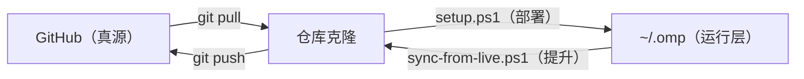

# omp-config

个人 Oh My Pi (omp) 配置仓库 — 跨机器同步配置、技能和工具。

## 三层同步模型

| 层级 | 路径 | 角色 |
|------|------|------|
| 运行层 | `~/.omp`（各机器本地） | omp 实际读取的配置；机器本地项（`shellPath`、`setupVersion`）只存在于这一层 |
| 仓库层 | 本仓库克隆 | 同步中转，模型定义（`models.yml`）与技能以此为源 |
| 真源层 | GitHub `origin/master` | 跨机器共同真源，所有机器从这里 pull |



- **拉方向**（部署）：`git pull` → `setup.ps1`。覆盖式部署，密钥按 provider 保留本地已填值。
- **推方向**（提升）：`sync-from-live.ps1`。把运行层的配置改动提升回仓库并 push，`shellPath`/`setupVersion` 自动剥离，真实 apiKey 永不入仓（详见文末「反向同步」）。
- **分工**：`models.yml` 模型定义、`skills/`、`lsp.json` 以仓库为源（推方向不回写）；角色/记忆/计费等 `config.yml`、`cost.json`、`settings.json` 改动双向流动。

## 目录结构

```
omp-config/
├── agent/                    # → ~/.omp/agent/
│   ├── config.yml            # 全局配置（modelRoles, memory/mnemopi, TUI；shellPath 由 setup 探测）
│   ├── models.yml            # 模型提供商；apiKey 仓库留占位符，本地手动填（setup 不再交互）
│   ├── lsp.json              # LSP 服务器（默认 PATH 裸名，setup 探测覆盖）
│   ├── cost.json             # 费用配置（人民币计价）
│   └── settings.json         # 持久化设置
├── scripts/
│   ├── omp-cny-patch.mjs     # 状态栏人民币计价补丁（setup 复制到 ~/.omp/）
│   └── bench-speed.ts        # 模型输出速度测试（仓库内 `bun` 运行，读 ~/.omp/agent/models.yml）
├── skills/                   # → ~/.omp/agent/skills/
├── setup.ps1                 # 一键部署脚本（仓库 → ~/.omp，Windows / PowerShell）
├── sync-from-live.ps1        # 反向同步脚本（~/.omp → 仓库，密钥不入仓）
└── README.md
```

## 在新机器上安装

> **PowerShell**：`setup.ps1` 同时支持 Windows PowerShell 5.1 与 PowerShell 7+（脚本已带 UTF-8 BOM，中文注释/输出在两种环境下均解析正常；终端若显示中文乱码仅影响显示，不影响执行）。

- `setup.ps1` 会自动安装/升级 bun 全局包到推荐的 **OMP 18.1.10**；patch 最低支持 18.0.2，已验证 18.0.3、18.0.11 与 18.1.10（三布局锚点）。18.0.1 原生 exe 布局不再作为 patch 目标。支持自定义 `BUN_INSTALL`（三脚本 `setup.ps1` / `omp-cny-patch.mjs` / `doctor.ps1` 同一约定）。
- 已安装 `bun`（patch 脚本用 bun 运行）
- 已安装语言服务器（gopls、pylsp 等）

### 步骤（一键部署）

```powershell
# 1. 克隆仓库
cd ~
git clone git@github.com:mr-money/omp-config.git

# 2. 一键部署（复制配置 + 探测路径 + 环境变量注入 key + 激活补丁）
cd omp-config
.\setup.ps1
```

脚本流程（自动执行，无需手动抄步骤）：
1. 校验 bun / omp 已安装
2. 复制 `agent/` → `~/.omp/agent/`、`skills/` → `~/.omp/agent/skills/`、`scripts/omp-cny-patch.mjs` → `~/.omp/`
3. 探测本机 pwsh / gopls / python 路径，写回对应配置
4. 注入 API Key：**不再交互输入**——仅从环境变量（`OMP_API_KEY`/`AMD_API_KEY`/`ZHIPU_API_KEY`）读取，设了就写入对应 provider；未设置则保留 `<...>` 占位符。重部署时**按 provider 保留本地已填的真实 key**（通用扫描全部 provider，非硬编码），结尾列出仍为占位符的 provider 与文件路径，提示手动编辑
5. 执行 `bun ~/.omp/omp-cny-patch.mjs --setup` 激活人民币计价补丁（布局 B 下同时安装自愈 wrapper）

只读健康检查：`.\doctor.ps1`。它检查 Bun、OMP/bundle 版本、四个配置文件存在性、CNY patch 版本标记、wrapper 及 gopls/python 是否可用，不会自动修复。注意它只查部署健康，不查 live 与仓库之间的内容漂移——漂移用 `.\sync-from-live.ps1` 的预检查看（无差异时会明确输出"无需同步"）。

### 配置项一览

| 文件 | 字段 | 部署方式 | 说明 |
|------|------|----------|------|
| `~/.omp/agent/models.yml` | `apiKey` | 环境变量注入 / 本地手动编辑 | 各 provider 的 key：火山 `OMP_API_KEY`、AMD `AMD_API_KEY`、智谱 `ZHIPU_API_KEY`。setup **不再交互**——设了环境变量就自动写入，没设则保留 `<...>` 占位符；重部署按 provider 保留本地已填真实 key，结尾列出未填项 |
| `~/.omp/agent/lsp.json` | `servers.*.command` | setup 探测覆盖 | 默认 PATH 裸名（`gopls` / `python -m pylsp`）；探测到绝对路径则写回 |
| `~/.omp/agent/config.yml` | `shellPath` | setup 探测写入 | 检测到 pwsh 则自动写入；未检测到则省略（omp 回退到 cmd.exe） |
| `~/.omp/agent/config.yml` | `statusLine.segmentOptions.git` | 直接复制 | 隐藏状态栏 git 段（分支 / +N staged / *N unstaged / ?N untracked） |
| `~/.omp/agent/settings.json` | — | 直接复制 | 不再单独设 shellPath，统一走 config.yml |

### 验证

```powershell
# 启动 omp，检查状态栏显示 ¥ 符号 / coding plan（订阅制提供商）
omp
# 或直接执行 bundle（布局 B，不经过 wrapper）
bun "%USERPROFILE%\.bun\install\global\node_modules\@oh-my-pi\pi-coding-agent\dist\cli.js"
```

- **上下文段（context_pct）**：只显示用量百分比，取整右对齐固定 4 列（`  0%`..`100%`），无窗口总量、宽度恒定

```powershell
# 检查补丁日志
cat ~/.omp/logs/omp-cny-patch.log
```

## 配置说明
### 状态栏 Git 段 (`config.yml` → `statusLine`)

```yaml
statusLine:
  segmentOptions:
    git:
      showBranch: false        # 隐藏分支名
      showStaged: false        # 隐藏 +N（已暂存）
      showUnstaged: false      # 隐藏 *N（未暂存）
      showUntracked: false     # 隐藏 ?N（未跟踪）
```

四项全关后 git 段整段隐藏（不显示分支与文件计数），其余状态栏段（model / path / context / cost 等）不受影响。保持 `statusLine.preset` 默认值不变，仅通过 `segmentOptions` 覆盖。

### 模型角色 (`config.yml` → `modelRoles`)

| 角色 | 模型 | 思考档位 | 用途 |
|------|------|----------|------|
| `default` | glm-5-3-flash | — | 默认主模型，日常编码 |
| `plan` | GLM-5.3 | `high` | 任务规划阶段 |
| `slow` | GLM-5.3 | `max` | 深度推理 / 复杂问题 |
| `smol` | deepseek-v4-flash-ga-260731 | `auto` | 轻量快速任务（方舟 DeepSeek V4 Flash，TTFT/吐字速度最优） |
| `advisor` | doubao-seed-evolving | `medium` | 顾问模式 |
| `designer` | doubao-seed-evolving | `medium` | UI/UX 设计任务 |
| `task` | glm-5-3-flash | `auto` | 任务子代理（委派多步任务） |
| `commit` | doubao-seed-2.0-mini | `off` | 生成 commit message |
| `vision` | doubao-seed-evolving | `auto` | 视觉/截图理解（方舟多模态） |
| `Free` | amd/Qwen3.8-Flash-Next | `high` | AMD 免费通道（免费提供商，不计费） |
| `Zhipu` | zhipu/glm-5.3-flash | `high` | 智谱 GLM（自有余额付费，备用） |
| `DeepSeek` | deepseek-v4-flash | `high` | 官方 DeepSeek API（omp 内置 provider，配 Key 后启用；备用，不在 `cycleOrder` 中） |

**思考档位循环 (`cycleOrder`)**: `smol` → `default` → `slow` → `Free`，逐级升档。

### 长期记忆 (`config.yml` → `memory` / `mnemopi`)

```yaml
memory:
  backend: mnemopi
mnemopi:
  scoping: per-project-tagged   # 写入项目库；召回时合并共享全局库
  embeddingVariant: multilingual # intfloat/multilingual-e5-large（本地 ONNX，中文语义召回）
  recallLimit: 10                # 每次召回最多注入的记忆条数（默认 8）
```

设计依据（源码验证，pi-mnemopi 18.x）：

- **`per-project-tagged` 优于 `per-project`**：写入项目隔离，召回还能带上全局记忆——跨项目通用经验（如 AMD 网关踩坑）仍可浮现。
- **不要开 `noEmbeddings: true`**：FTS5 默认 `unicode61` tokenizer 对中文按整句切分（无分词），关掉向量召回会让中文查询只能逐字命中；`multilingual` e5 本地推理无网络依赖、无费用，是中文召回主力。
- **`llmMode: smol`**：事实抽取/整理走 `tiny`→`smol` 角色（doubao-seed-2.0-mini），免费额度内。
- **consolidation 需手动触发**：正常退出只做轻量 drain，working → episodic 晋级与图谱构建仅在 `/memory enqueue` 时发生（且只整理 >12h 的行）；重要会话结束前跑一次。
- **进阶开关保持关闭**：`polyphonicRecall` 的 graph voice 依赖 consolidation 产生的 `gists`/`graph_edges`（未触发时恒为空）；`proactiveLinking` 的实体抽取为英文偏置正则，中文收益微弱。

### 模型提供商 (`models.yml`)

内置火山引擎大模型 API（方舟，coding plan 订阅制）：
- **glm-5-3-flash** — 默认模型（1M 上下文）
- **glm-5.3** — 规划 / 慢速深度推理（1M 上下文）
- **deepseek-v4-flash-ga-260731** — `smol` 角色主力（1M 上下文；TTFT ~440ms、~86 tok/s，全表最快）
- **doubao-seed-2.0-mini** — 轻量 / commit / mnemopi 记忆抽取（`tiny`/`commit` 角色）
- **doubao-seed-evolving** — 顾问 / 设计 / 视觉（`advisor`、`designer`、`vision` 角色）（1M 上下文，多模态）

AMD 免费通道（`amd` provider，AMD Radeon 开发者平台，OpenAI 兼容）：
- **DeepSeek-V4-Flash-Vision-Exp** — 视觉模型（1M 上下文，支持文本+图像，`reasoning`；曾用于 `vision`/`Free` 角色，因 TTFT 10–50s 已淡出高频角色）
- **DeepSeek-V4-Flash** — 纯文本（1M 上下文，`reasoning`）
- **Qwen3.8-Flash-Next** — `Free` 角色（262K 上下文，纯文本，`reasoning`）

`amd` provider 为**免费额度**，计入 `freeProviders`，状态栏显示 `coding plan` 不计费；`apiKey`（`rc-` 前缀）为 AMD 开发者平台 key，仓库中保持占位脱敏，部署后本地手动编辑 `~/.omp/agent/models.yml` 填入。

智谱 GLM（`zhipu` provider，智谱开放平台，OpenAI 兼容）：
- **glm-5.3-flash** — `Zhipu` 角色备用；多模态（文本+图像），1M 上下文，131K 输出上限，`reasoning`（思考档位 `low/high/max`，默认 `max`）
- `baseUrl: https://open.bigmodel.cn/api/paas/v4`，请求自动落到 `/chat/completions`；`open.bigmodel.cn` 主机会被自动识别为智谱，走 `zai` thinking 方言（`thinking.type: enabled` + `reasoning_effort`，工具调用时自动开启 `tool_stream`）
- 价格（元/百万 tokens）：输入 **0.8**、输出 **2.8**、缓存命中 **0.23**、缓存写入 **0.8**。`models.yml` 中按美元计价（`元 ÷ 7.25`）：`input 0.110345 / output 0.386207 / cacheRead 0.031724 / cacheWrite 0.110345`，状态栏自动按 `rate` 换算回人民币显示。

> **DeepSeek 官方通道（`deepseek` provider）**：`config.yml` 的 `DeepSeek` 角色与 `cost.json` 定价指向**官方 DeepSeek API**。该 provider（`api.deepseek.com`）由 **omp 内置**，无需在 `models.yml` 配置——外部配置仅含火山 `volcengine-coding`、AMD `amd` 与智谱 `zhipu`。使用前只需在 omp 设置（`/models`）中为 `deepseek` 填入官方 API Key 即可启用。

### 新增模型提供商节点（`models.yml`）

在 `providers:` 下追加一个 provider 块即可（参考现有 `amd` / `zhipu` 节点）。**无需阅读 omp 底层代码**，只需满足以下几点：

```yaml
providers:
  myprovider:                       # ① 唯一 provider 名（小写字母/数字/连字符）
    baseUrl: https://…/v1          # ② OpenAI 兼容端点基址（不含 /chat/completions，omp 自动拼接）
    api: openai-completions        # ③ 固定 openai-completions（绝大多数厂商都兼容）
    apiKey: <MY_API_KEY>           # ④ 占位符脱敏；本地手动编辑填入（setup 不再交互，见下"占位符约定"）
    authHeader: true               # ⑤ 固定 true（key 走 Authorization: Bearer）
    models:
      - id: my-model               # ⑥ 模型 ID（API 请求里的 model 字段，必须与厂商一致）
        name: 显示名
        input: [text, image]       # ⑦ 能力声明：支持图像就写 [text, image]，否则 [text]
        contextWindow: 1000000     # ⑧ 上下文窗口（token）
        maxTokens: 65536           # ⑨ 输出上限（token）
        reasoning: true            # ⑩ 思考模型才写 true（自动派生思考档位）
        cost:                      # ⑪ 计价（美元/百万 tokens）：状态栏价格 = cost × rate 换算人民币
          input: 0.110345          #    输入价（人民币价 ÷ 汇率，如 0.8 ÷ 7.25）
          output: 0.386207         #    输出价（2.8 ÷ 7.25）
          cacheRead: 0.031724      #    缓存命中价（0.23 ÷ 7.25）
          cacheWrite: 0.110345     #    缓存写入价（0.8 ÷ 7.25）
        compat:                    # ⑫ 绝大多数情况照抄，不用改
          supportsDeveloperRole: false
          maxTokensField: max_tokens
```

要点：

- **思考档位自动派生**：`reasoning: true` 后 omp 按模型 ID 自动识别（如 GLM-5.3+/Kimi K3 得到 `low/high/max`、默认 `max`），**不要**手写 `thinking:` 块，除非默认档位不对。
- **多模态**：厂商支持图像就把 `input` 写 `[text, image]`，omp 会自动按 `image_url` 内容块发送。
- **状态栏计价**：价格写在模型 `cost` 块里，**按美元/百万 tokens 计价**（= 人民币价 ÷ `rate`），状态栏显示 `¥ <USD × rate>`。不写 `cost` 则不显示价格或显示免费。
- **验证**：`omp models ls` 应能看到新 provider 与模型；若有 `models.yml validation failed` 报错，说明字段名或取值不合法（对照上面模板检查）。
- **占位符约定**：仓库中 `apiKey` 一律用 `<XXX_API_KEY>` 占位脱敏；**setup 不再交互填 key**——部署时按 provider 保留本地已填的真实 key，未填项在结尾列出并提示手动编辑 `~/.omp/agent/models.yml`。已知 provider（火山/AMD/智谱）可选设环境变量（`OMP_API_KEY`/`AMD_API_KEY`/`ZHIPU_API_KEY`）自动注入；新增 provider 若要环境变量注入，需在 `setup.ps1` 的 `$envVarByProvider` 登记其环境变量名。

> **DeepSeek 官方通道（`deepseek` provider）**：`config.yml` 的 `DeepSeek` 角色与 `cost.json` 定价指向**官方 DeepSeek API**。该 provider（`api.deepseek.com`）由 **omp 内置**，无需在 `models.yml` 配置——外部配置仅含火山 `volcengine-coding`、AMD `amd` 与智谱 `zhipu`。使用前只需在 omp 设置（`/models`）中为 `deepseek` 填入官方 API Key 即可启用。

### 模型输出速度测试 (`scripts/bench-speed.ts`)

仓库内用 bun 运行，读**部署后**的 `~/.omp/agent/models.yml`（真实 key 在这里），对每个 provider 的每个模型顺序发一次流式请求，测输出速度。

```powershell
bun scripts/bench-speed.ts                 # 测全部
bun scripts/bench-speed.ts --only glm      # 只测 id 含 "glm" 的模型
bun scripts/bench-speed.ts --list          # 只列待测清单，不发请求
```

指标：

- **TTFT(ms)** — 请求发出到**首个增量 chunk**（含网络 + 排队 + 模型首 token）。基线必须在 `fetch` 之前取：部分网关把响应头憋到首 token 才发，`fetch` 返回后取基线会得到恒为 0 的假值。
- **tok/s** — `usage.completion_tokens ÷ (末 chunk − 首 chunk)`。无 usage 时按增量 chunk 数近似并标 `(approx)`。
- **生成(s) / 总(s)** — 纯生成时长 / 整个请求墙钟（`总 ≥ TTFT + 生成`，可用来自查数据一致性）。
- 只测速度，**不测成本**。

**成本控制**：固定短 prompt（"用一句话介绍你自己。"）+ 输出硬顶 `max_tokens: 128` + 每模型仅 1 次、顺序执行、测速失败不重试（并发会互相干扰测速数字，重试烧双倍钱）。全量一轮约几千 token。占位符 `<...>` 的 provider 整组跳过（`SKIP`）。

**厂商差异（脚本已自动处理，状态列有标注）**：

| 现象 | 处理 |
|------|------|
| doubao-seed 系**不尊重** `max_tokens`（实测一次输出 871 token，思考 token 不计入上限） | 检测 `completion_tokens` 超限后改用标准字段 `max_completion_tokens` 重试 → `(cap via max_completion_tokens)`；仍超限标 `(cap ignored)` |
| 厂商"关思考"参数被拒（400） | 去掉扩展参数降级重试 → `(extras off)` |
| AMD 网关**整段一次性返回**（单增量 chunk），生成时长为 0 | tok/s 退化为用 TTFT 作分母的**下界估计** → `(single-chunk, rate~lower bound)`；此时真实瓶颈看 TTFT |
| AMD 思考增量在 `delta.reasoning`（非 `reasoning_content`） | 增量检测同时认三个字段，否则 AMD 的 TTFT 会虚高成"思考结束后首个正文 token" |
| 智谱 **GLM-5.3 起强制思考**，`thinking: {type: disabled}` 直接报错 | 改用 `reasoning_effort: low` 降档；更早的 GLM 仍用 `thinking.disabled` |
| AMD 平台并发限流（`global_concurrency_rate_limit_exceeded`，64 并发） | 记 `FAIL` 不重试；重跑即可，避开挤满时段 |

**实测参考**（一轮全量，仅供横向比较；TTFT 受网络与厂商排队影响波动较大）：

| provider | model | TTFT(ms) | tok/s |
|----------|-------|---------:|------:|
| volcengine-coding | glm-5.3 | 5191 | 33.8 |
| volcengine-coding | glm-5-3-flash | 4940 | 23.1 |
| volcengine-coding | doubao-seed-2.0-mini | 521 | 91.7 |
| volcengine-coding | doubao-seed-evolving | 857 | 30.0 |
| volcengine-coding | deepseek-v4-flash-ga-260731 | 444 | 85.9 |
| amd | DeepSeek-V4-Flash-Vision-Exp | 50714 | ~0.7 ¹ |
| amd | DeepSeek-V4-Flash | 11056 | ~2.1 ¹ |
| amd | Qwen3.8-Flash-Next | 2211 | 101.4 |
| zhipu | glm-5.3-flash | 750 | 30.0 |

¹ 单 chunk 一次性返回，tok/s 为下界；真实瓶颈是 TTFT（AMD 免费通道常排在几十秒队列后）。

选型提示：**火山 doubao-seed-2.0-mini / deepseek-v4-flash** 首 token 快且吐字最快，适合 `smol`/`commit`/`task` 等高频轻任务；**AMD 免费通道**首 token 动辄 10–50s，只适合不催人的后台任务（`Free` 角色）。

### 费用 (`cost.json`)

- **`freeProviders: ["volcengine-coding", "amd"]`** — 火山引擎 coding plan 与 AMD 免费通道为订阅/免费制，状态栏显示 `coding plan`，不计 token 费用、不显示顾问尾巴
- **DeepSeek 官方 API** — 按量付费，人民币计价（汇率 7.25）。18.x 原生按 provider 定价计算成本；补丁负责 `$`→`¥` 与 `×汇率`：
  - 定价来源：[DeepSeek 官方定价页](https://api-docs.deepseek.com/zh-cn/quick_start/pricing/)（价格如有变动，以此页为准）
  - 覆盖模型：`deepseek-v4-flash`、`deepseek-v4-flash-vision-exp`、`deepseek-v4-pro`
  - V4 Flash / V4 Flash Vision（元/百万 tokens）：
    | 项目 | 空闲时段 | 高峰时段 |
    |------|---------|---------|
    | 输入（缓存命中） | 0.05 | 0.10 |
    | 输入（缓存未命中） | 1.5 | 3.0 |
    | 输出 | 4.5 | 9.0 |
  - V4 Pro（元/百万 tokens）：
    | 项目 | 空闲时段 | 高峰时段 |
    |------|---------|---------|
    | 输入（缓存命中） | 0.15 | 0.30 |
    | 输入（缓存未命中） | 4.5 | 9.0 |
    | 输出 | 13.5 | 27.0 |

  > **定价机制**：omp 18.x（含 18.1.10）状态栏价格来自各模型的 `models.yml` `cost` 块（美元/百万 tokens，人民币价 ÷ 汇率），补丁只做 `×汇率` 与 `¥` 符号。`cost.json` 的 `models`（peak/offpeak）块是旧版（≤18.0.3）遗留，现版补丁已不再读取；DeepSeek 若需精确计价，把上表人民币价 ÷ 7.25 写进 `deepseek` 模型的 `cost` 块（omp 内置 provider 亦可通过 `modelOverrides` 覆盖）。

补丁改写三处代码（仅支持 **omp 18.0.2+ bun 全局包**，18.0.1 原生 exe 布局不再支持）：

`omp.exe` 是 8KB bun shim，bundle 是普通 JS（`dist/cli.js`），可任意改长度。补丁在 bundle 头部注入运行时 helpers（`__cnyCfg`/`__cnyFmt`/`__cnyIsFree`），运行时读取 `~/.omp/agent/cost.json`，并字符串替换三处：

1. 费用格式化函数（18.0.3 中为 `xEs()`，18.0.11 中为 `AXn()`，18.1.10 中为 `wAn()`）：`$<USD>` → `¥<USD×汇率>`（汇率默认 7.25）
2. `id:"cost"` 状态段：注入 `freeProviders` 检查——当模型 provider 为订阅制（默认 `volcengine-coding`）时显示 `coding plan` 而非 token 价格，并隐藏顾问尾巴
3. `id:"context_pct"` 状态段：去掉 `xx.x%/window` 双数字（窗口总量），只留用量百分比，且取整右对齐为固定 4 列（`  0%`..`100%`）——上下文段宽度恒定不变

`cost.json` 是唯一配置源（运行时读取），缺文件时回退默认值（¥ / 7.25 / `["volcengine-coding"]`）。

>
**版本 manifest**：最低支持 `18.0.2`，推荐 `18.1.10`，当前已验证 `18.0.3` + `18.0.11` + `18.1.10`，patch 版本为 `2026.09.05.1`。补丁按「布局表」匹配 bundle：每个已知版本布局有独立锚点组，全部命中才套用（见下）；低于最低版本时自动升级并重新读取 package.json；升级未达到最低版本会安全失败，不会继续留下半 patch。

**每次 `--check` 幂等**：已补丁则 no-op；`omp update` 重装后下次运行自动重打。首次补丁自动备份 `<target>.orig` 供 `--restore` 回滚。

**自愈 wrapper（`--setup`）**：`omp update` 每次都会重写 `dist/cli.js`（补丁丢失）并重建 `omp.exe` shim（会遮蔽 wrapper）。`--setup` 会把 bun 的 `omp.exe` shim 改名成 `omp.exe.bak`，安装 `~/.bun/bin/omp.cmd` 包装器——每次 `omp` 启动先跑 `--check`（自动重打补丁）再启动 bundle；`omp update` 命令结束时自动再跑一次 `--setup` 夺回 shim 并重打补丁，全程无需手动干预。回滚 `--restore` 会移除 wrapper 并还原 shim。

**兼容性（已验证）**：
- omp `18.0.3`、`18.0.11` 与 `18.1.10`（bun 全局包，plain-JS bundle）。18.0.11 重构了 status line 代码（`xEs`→`AXn`、`C_i`→`tKr`、`Ae`→`Ee`、`XE`→`iA`、`zl`→`Wl`，`isAdvisorUsingSubscription` 移入 advisor 分支）；18.1.10 再次漂移（`AXn`→`wAn`、`tKr`→`aDi`、`Ee`→`pi∘Ae`、`iA`→`_E`、`Wl`→`ml`、`S`→`k`，cost/context 段新增 `startupPlaceholder` 占位分支），布局表据此区分三代锚点；未来版本再漂移时会响亮报错而不是半 patch。

工作原理：
- 定位 bundle：`~/.bun/install/global/node_modules/@oh-my-pi/pi-coding-agent/dist/cli.js`
- 首次补丁备份 `<target>.orig`；替换用「暂存 `.cny` → 重命名换入」避免 Windows 对运行中文件的写入锁（EBUSY）
- 顾问段：仅计费（非 coding plan）提供商显示 `+ ¥x (adv)`；coding plan 提供商只显示 `coding plan`
- **峰谷定价已不再注入**：按 provider 定价计算 `usageStats.cost`，补丁只做 `×汇率` 与 ¥ 符号
- 升级后 `.orig` 自动刷新（避免 `--restore` 降级到旧版本 bundle）
- 回滚：`bun ~/.omp/omp-cny-patch.mjs --restore`（还原 `.orig`、移除 wrapper、还原 shim）

### 安装布局与单入口（当前状态）

当前机器使用 **omp 18.1.10 bun 全局包**，只有单一入口：

- `~/.bun/bin/omp.cmd` — 启动包装器：先跑 `bun ~/.omp/omp-cny-patch.mjs --check` 自愈补丁，再启动 bundle；`omp update` 结束后自动重跑 `--setup` 夺回 shim。bundle 路径在生成 wrapper 时按 `BUN_INSTALL` 解析（`bun install -g` 换目录后重跑 `--setup` 即可）
- `~/.bun/install/global/node_modules/@oh-my-pi/pi-coding-agent/dist/cli.js` — 真实 bundle（已打补丁）
- `~/.bun/bin/omp.bunx` / `~/.bun/bin/omp.exe.bak` — bun 生成 shim（8–16KB，非独立程序；被 wrapper 改名暂存）

**无版本冲突**：PATH 仅含 `~/.bun/bin` 一处 omp 入口，`where omp` 只命中 `omp.cmd`，无独立原生 exe 可执行。`omp.exe` shim 在 `omp update` 时由 bun 重建，wrapper 的 update 钩子会立即夺回。

### 技能

来自 [anthropics/skills](https://github.com/anthropics/skills) 开源仓库：
- **grill-me/grilling/grill-with-docs/domain-modeling** — 追问与领域建模
- **docx/pptx/xlsx/pdf** — 文档创建与编辑（文档操作技能）

另含 **caveman**（极简沟通模式）— 源自 [juliusbrussee/caveman](https://github.com/JuliusBrussee/caveman)，随其余技能一同部署到 `~/.omp/agent/skills/`。omp 的 native 技能源（`~/.omp/agent/skills/`）优先级高于 codex 源（`~/.codex/skills/`），同名技能会优先从 native 加载。

## 更新

```powershell
# 拉取最新配置 + 重新部署（幂等）
cd ~/omp-config && git pull
.\setup.ps1
```

`setup.ps1` 幂等：重复运行覆盖最新配置、保留已填 API Key、patch 已应用则 no-op。注意：部署会以仓库版本覆盖 live `config.yml`（仅 `shellPath` 由探测回写保护）——若你在 omp 里改过配置，先跑 `.\sync-from-live.ps1` 提升再部署，否则改动会被回退。

## 反向同步（`~/.omp` → 仓库 → GitHub）

在 omp 里改了角色/配置（`/models` 等）后，把改动提升回仓库，供其他机器部署：

```powershell
.\sync-from-live.ps1            # 预检漂移 → 确认 → 同步 → commit → push
.\sync-from-live.ps1 -NoPush    # 只 commit 不 push（网络不便时）
.\sync-from-live.ps1 -Yes       # 跳过确认
```

行为细节：

| 文件 | 处理 |
|------|------|
| `config.yml` | 复制后**剥离 `shellPath` / `setupVersion`**（机器本地状态，按设计不入仓） |
| `cost.json` / `settings.json` | 直接覆盖入库 |
| `models.yml` | **不覆盖**模型定义（仓库为源）；只做密钥防线检查——仓库中出现非 `<...>` 占位符的真实 apiKey 立即中止提交，live 中已填的真实 key 一律不入仓 |
| `lsp.json` / `skills/` | 跳过（部署方向才探测覆盖） |

- 仓库有未提交改动时拒绝运行（推方向起点必须干净），避免把无关内容混进同步提交
- 剥离机器本地项后无实际差异则跳过提交（幂等）
- commit message 固定格式 `sync: promote live config changes (<日期>)`

## 日常同步节奏（推荐）

```powershell
# 改配置后（omp 内 /models 等）
.\sync-from-live.ps1          # 提升 + push，GitHub 立即拥有最新配置

# 到另一台机器
git pull; .\setup.ps1         # 拉取 + 部署

# 不确定哪边新？
.\sync-from-live.ps1          # 无差异会明确说"无需同步"；有差异列出摘要再决定
```

多台机器同时改过的收敛方式：先 `git pull --rebase`（收别人的），再 `.\sync-from-live.ps1`（推自己的），冲突只在仓库层出现，手工解一次即可。
